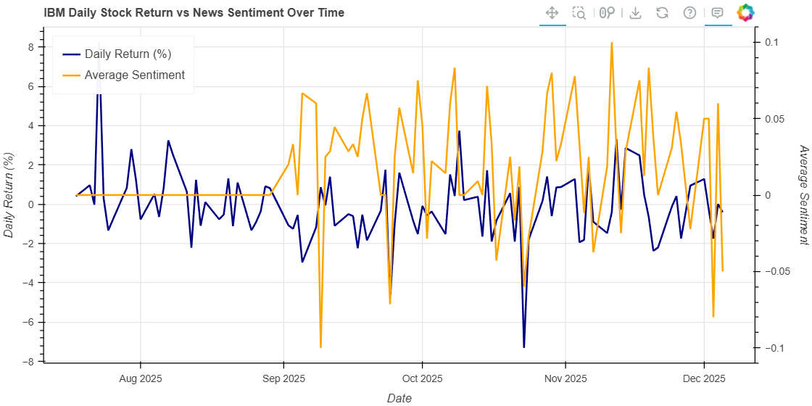
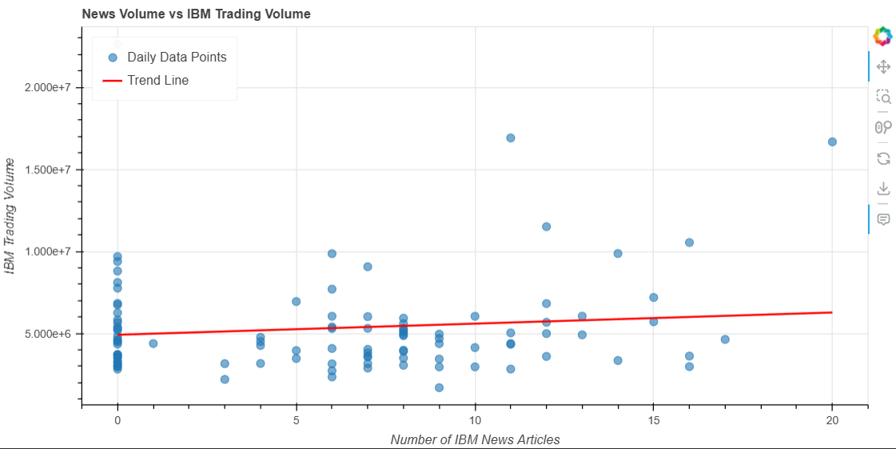
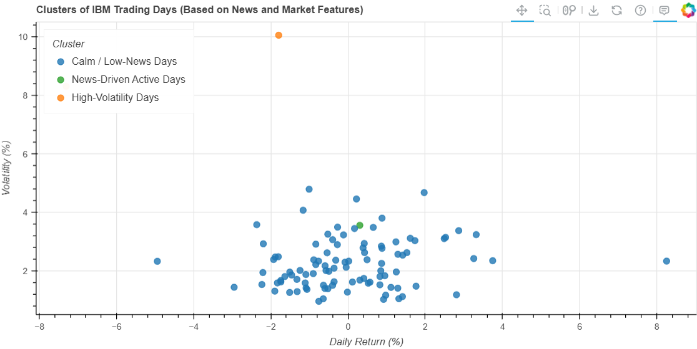

# Multi-Source Market Intelligence: IBM Stock Analysis with NLP Based News Sentiment

A comprehensive data analysis project examining the relationship between IBM-related news coverage and stock market performance through sentiment analysis, correlation studies, and clustering techniques.

## Project Overview

This project investigates whether IBM-related news sentiment and coverage volume correlate with the company's stock market behavior. By integrating financial market data with natural language processing, the analysis explores patterns between media activity and key market metrics including stock volatility, trading volume, and daily returns.

**Analysis Period:** July 18, 2025 - December 8, 2025  
**Total Daily Records:** 100 matched observations  
**News Articles Analyzed:** 824 articles (after deduplication)

## Key Features

- **Multi-Source Data Integration**: Combines stock market data from Alpha Vantage API with news articles from Mediastack API
- **Sentiment Analysis**: Utilizes Google Cloud Natural Language API to compute sentiment scores for news headlines and descriptions
- **Interactive Visualizations**: Built with Bokeh for dynamic, explorable data visualizations
- **Statistical Analysis**: Includes correlation analysis, volatility measures, and clustering techniques
- **Comprehensive Metrics**: Tracks daily returns, price volatility, trading volume, news sentiment, and article counts

## Technical Stack

**Programming Language:** Python  
**Data Sources:**
- Alpha Vantage API (Stock Market Data)
- Mediastack API (News Articles)
- Google Cloud Natural Language (Sentiment Analysis)

**Core Libraries:**
- `pandas` - Data manipulation and analysis
- `numpy` - Numerical computations
- `scikit-learn` - Machine learning (StandardScaler, KMeans)
- `bokeh` - Interactive visualizations
- `google-cloud-language` - NLP sentiment analysis
- `requests` - API integration

## Dataset Information

### 1. Stock Market Data (Alpha Vantage)
- **Source:** TIME_SERIES_DAILY endpoint
- **Records:** 100 daily observations
- **Metrics:** Open, High, Low, Close prices, Trading Volume
- **Computed Features:** 
  - Daily change
  - Daily return percentage
  - Percent change
  - Volatility (High-Low spread)
  - Volatility percentage

### 2. News Data (Mediastack + Google NLU)
- **Source:** Mediastack News API with pagination
- **Period:** September 1, 2025 - December 8, 2025
- **Articles:** 824 articles (post-deduplication)
- **Features:**
  - Headlines and descriptions
  - Publication dates
  - Sentiment scores (-1 to +1 range)
  - Daily aggregated metrics

### 3. Merged Dataset
The final dataset contains **100 fully matched daily records** with:
- Stock price metrics
- Trading volume
- News article count per day
- Average daily sentiment score

## Research Questions & Findings

### 1. News Sentiment vs Stock Returns
**Question:** How do IBM's daily stock returns correlate with news sentiment?

**Methodology:** Dual-axis time series comparing daily returns with average sentiment scores

**Finding:** Stock sensitivity increased during periods of unstable news sentiment, particularly in October and November. Days with volatile sentiment scores corresponded with wider High-Low price gaps and larger daily swings.



---

### 2. News Volume Impact on Trading Activity
**Question:** Do days with higher news article counts correspond to higher trading volume?

**Methodology:** Scatter plot with linear regression trend line

**Finding:** A positive correlation exists between news volume and trading activity. Days with more IBM-related news articles showed increased trading volume, indicating heightened market attention and investor engagement.



---

### 3. Trading Day Classification
**Question:** Can we group trading days into behavioral clusters based on multiple features?

**Methodology:** K-Means clustering (k=3) using standardized features: daily return, volatility, volume, news count, and sentiment

**Clusters Identified:**
- **Cluster 0:** Calm / Low-News Days - Stable prices with minimal news coverage
- **Cluster 1:** High-Volatility Days - Significant price swings independent of news volume
- **Cluster 2:** News-Driven Active Days - Higher trading activity correlated with increased media attention

**Finding:** Trading days naturally segmented into distinct behavioral patterns, with news-active days showing measurably different market characteristics compared to calm trading periods.



## Key Insights

1. **Sentiment Sensitivity:** Stock volatility increases during periods of unstable or fluctuating news sentiment, particularly in October-November
2. **Media Attention Effect:** Higher news coverage directly correlates with increased trading volume, indicating heightened market attention
3. **Market Behavior Types:** Trading days naturally cluster into distinct categories (calm, high-volatility, news-driven) based on news activity and market metrics

## Project Structure

```
Financial-News-Sentiment/
├── KADAKIA_SARANG_dataproject01_dwd_spring2025.ipynb  # Main analysis notebook
├── ibm_final_dataset.csv                               # Merged dataset
└── README.md                                            # Project documentation
```

## Setup & Installation

### Prerequisites
- Python 3.8+
- Google Cloud Platform account (for Natural Language API)
- API Keys:
  - Alpha Vantage API key
  - Mediastack API key
  - Google Cloud service account credentials

### Installation Steps

1. Clone the repository:
```bash
git clone https://github.com/yourusername/financial-news-sentiment.git
cd financial-news-sentiment
```

2. Install required packages:
```bash
pip install pandas numpy scikit-learn bokeh google-cloud-language requests
```

3. Configure API credentials:
   - Set up Google Cloud credentials JSON file
   - Update API keys in the notebook

4. Run the Jupyter notebook:
```bash
jupyter notebook KADAKIA_SARANG_dataproject01_dwd_spring2025.ipynb
```

## Usage

The analysis is organized into five main sections:

1. **D1: Library Imports** - Load required dependencies
2. **D2: Data Pre-Processing** - Fetch and merge stock and news data
3. **D3: Data Analysis** - Execute five research questions with visualizations
4. **D4: Summary of Findings** - Key insights and interpretations
5. **D5: Future Research** - Proposed extensions

All visualizations are interactive - hover over data points for detailed information, and click legend items to toggle series visibility.

## Data Processing Pipeline

```
Alpha Vantage API → Stock DataFrame
                                    ↘
                                     Merge on Date → Final Analysis Dataset
                                    ↗
Mediastack API → News DataFrame → Google NLU → Sentiment Scores
```

### Key Processing Steps:
1. Fetch IBM stock data (100 daily records)
2. Retrieve IBM news articles with pagination (824 articles)
3. Compute sentiment scores using Google Cloud NLU
4. Aggregate news data by date (article count + average sentiment)
5. Merge datasets on date field
6. Compute derived metrics (returns, volatility, etc.)
7. Execute analytical queries and generate visualizations

## Future Research Directions

### 1. Multi-Company Comparison
Expand analysis to include:
- **Walmart:** Stable, mature company baseline
- **Nvidia:** High-growth AI sector representative

**Goal:** Compare how different company profiles respond to similar news patterns and market conditions

### 2. External Event Impact Analysis
Investigate correlation with:
- Federal Reserve interest rate announcements
- Semiconductor trade policy changes
- Major tech sector events

**Goal:** Identify whether external macroeconomic events produce synchronized or divergent reactions across different company types

### 3. Predictive Modeling
Develop machine learning models to:
- Forecast next-day volatility based on news sentiment
- Predict trading volume spikes from article counts
- Classify market days before they occur

## Limitations

- **Limited Time Span:** Analysis covers ~5 months of data
- **Single Company Focus:** Results may not generalize to other stocks
- **Sentiment Simplification:** Binary positive/negative scores may miss nuanced market interpretation
- **Causation vs Correlation:** Analysis identifies patterns but doesn't establish causal mechanisms
- **External Factors:** Broader market trends and macroeconomic conditions not explicitly modeled

## Contributing

Contributions are welcome! Areas for improvement:
- Additional data sources and APIs
- Alternative sentiment analysis methods
- Advanced statistical techniques
- Extended time period analysis
- Multi-company comparative studies

## License

This project is available for educational and research purposes.

## Author

**Sarang Pinakin Kadakia**  
Data Analytics Project - Spring 2025

## Acknowledgments

- Alpha Vantage for stock market data API
- Mediastack for news article API
- Google Cloud Natural Language for sentiment analysis
- Bokeh development team for visualization library

---

**Note:** This project was developed as part of a graduate-level data analytics course to demonstrate API integration, data preprocessing, statistical analysis, and interactive visualization capabilities.
